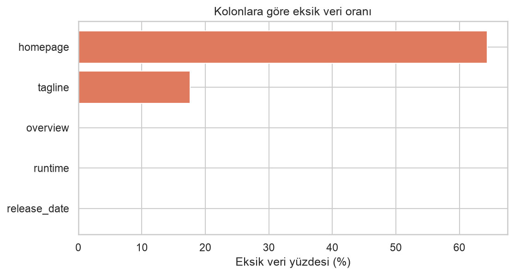
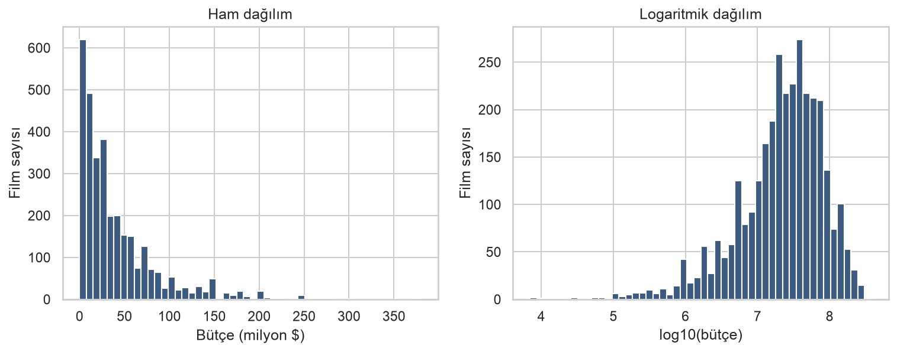
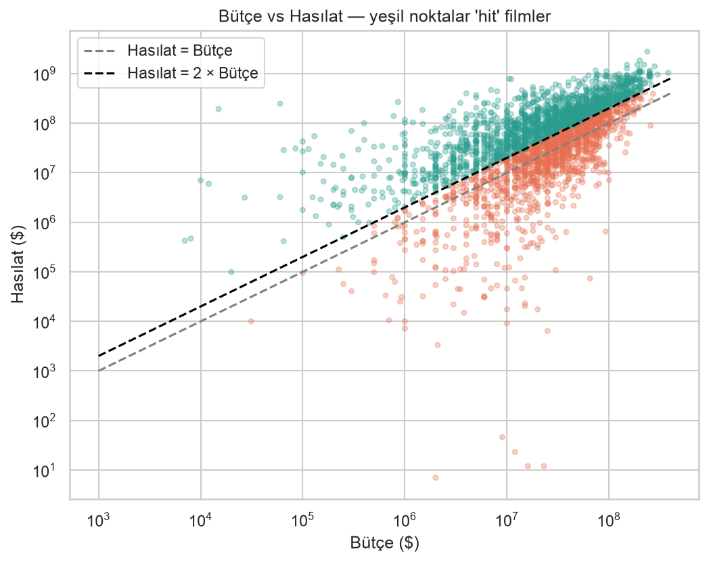
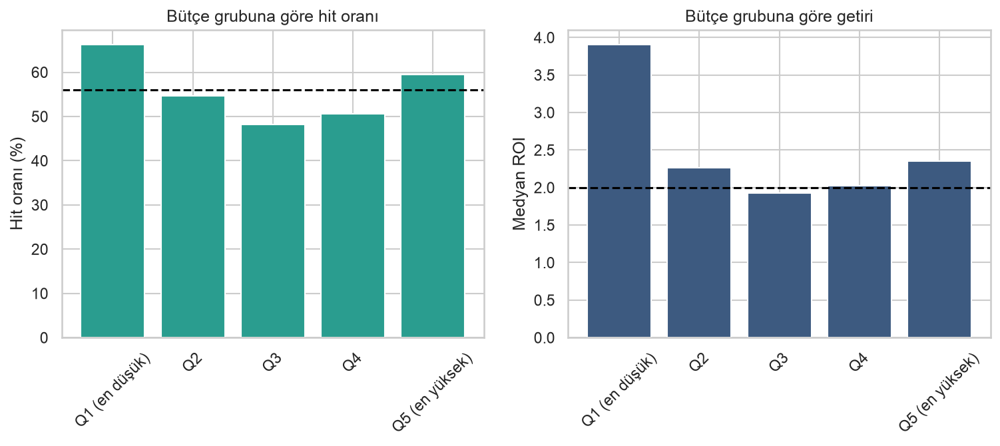
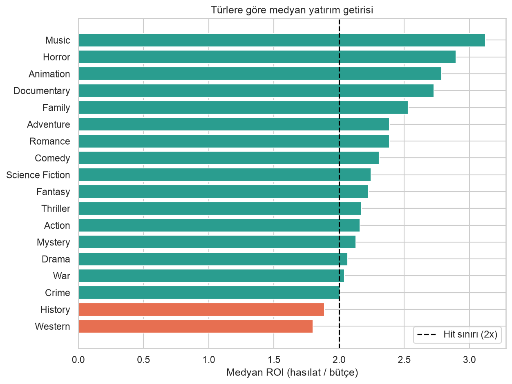
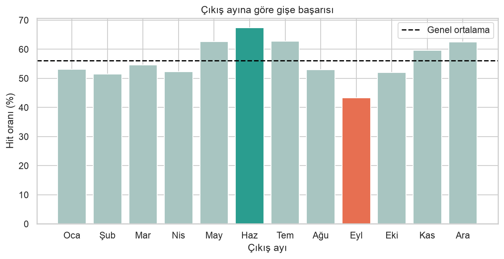
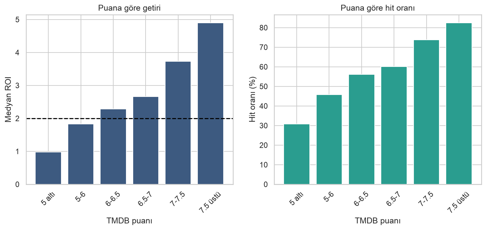
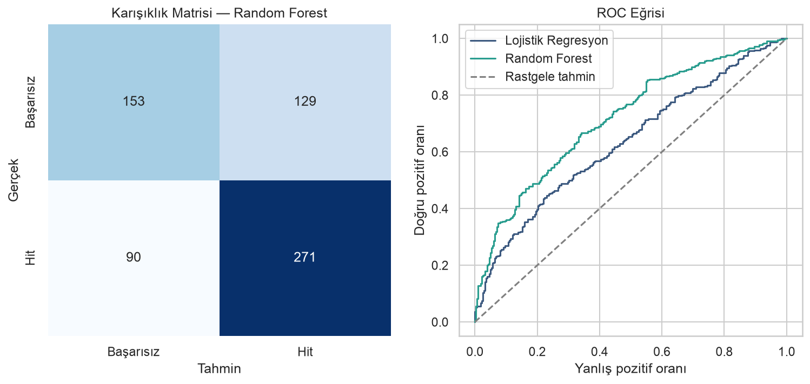
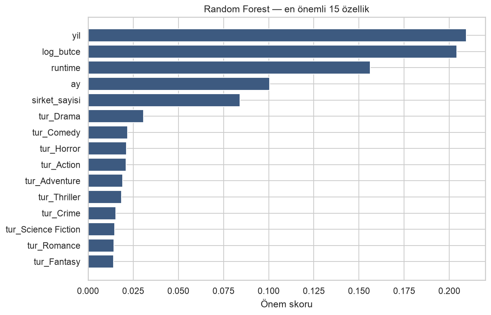

# Bir Film Gişede Tutar mı? 3.215 Filmlik Veriyle Cevap Aradım

## Avatar'ın 237 milyon dolarlık bütçesi 2,8 milyar dolara döndü. Peki bunu önceden bilebilir miydik?

---

Bir stüdyo yöneticisi olduğunuzu düşünün. Önünüzde bir senaryo var: 40 milyon dolarlık bütçe, 110 dakikalık bir gerilim filmi, eylül ayında vizyona girecek. Bu filme yeşil ışık yakar mıydınız?

Bu yazıda tam olarak bu soruyu veriye sordum. TMDB'nin 5.000 filmlik veri setiyle keşifsel bir analiz yaptım, sonra bir film vizyona girmeden **önce** bilinebilecek bilgilerle gişe başarısını tahmin eden bir sınıflandırma modeli kurdum.

Sonuç beklediğimden çok daha öğreticiydi — ama modelin doğruluk oranı yüzünden değil. Yol boyunca düştüğüm dört tuzak yüzünden. Dördü de sessizdi: hiçbiri hata vermedi, hepsi güzel bir sayı üretti ve o sayı yanlıştı.

> 📓 Tüm kod ve grafikler Google Colab notebook'unda: **https://colab.research.google.com/drive/15lBCGCA53hVWWbVTLntPol1iSwhPVl-z?usp=sharing**

---

## 1. Veri Seti: TMDB 5000 Movies

Analizde [TMDB 5000 Movie Dataset](https://www.kaggle.com/datasets/tmdb/tmdb-movie-metadata) kullandım. The Movie Database'den derlenmiş, **4.803 satır ve 20 kolondan** oluşan bir veri seti.

Başlıca kolonlar:

| Kolon | Açıklama |
|---|---|
| `budget` / `revenue` | Yapım bütçesi ve dünya çapında hasılat ($) |
| `genres` | Film türleri (JSON formatında) |
| `runtime` | Süre (dakika) |
| `release_date` | Vizyon tarihi |
| `production_companies` | Yapım şirketleri (JSON) |
| `vote_average` / `vote_count` | TMDB kullanıcı puanı ve oy sayısı |
| `popularity` | TMDB popülerlik skoru |

İlk bakışta gayet temiz görünüyordu. `df.isnull().sum()` çalıştırdığımda `budget` ve `revenue` kolonlarında **sıfır eksik değer** vardı.

İlk tuzak buradaydı.

---

## 2. Tuzak #1: `isnull()` Bana Yalan Söyledi

`budget` kolonunda eksik değer yoktu, çünkü eksik değerler `NaN` olarak değil, **0 olarak** kaydedilmişti.

```python
print("budget  = 0 olan film sayisi:", (df["budget"] == 0).sum())    # 1037
print("revenue = 0 olan film sayisi:", (df["revenue"] == 0).sum())   # 1427
```

**1.037 film**in bütçesi, **1.427 film**in hasılatı sıfır görünüyordu. Bir filmin gerçekten 0 dolara çekilmesi mümkün değil — bunlar "bilinmiyor" demekti.

Fark ne kadar önemli? Ortalama bütçeye bakalım:

- Sıfırlar dahil: **29.045.040 $**
- Sıfırlar hariç: **37.042.838 $**

Aradaki fark **%28**. Bu tuzağı fark etmeseydim, yazdığım her cümle sistematik olarak yanlış olacaktı.


*`homepage` kolonunun %64'ü boş — ama asıl sorun bu grafikte hiç görünmüyor.*

**Ders:** `isnull()` bir başlangıç noktasıdır, bitiş noktası değil. Sayısal kolonlarda sıfırların, kategorik kolonlarda "Unknown" / "N/A" / "-" değerlerinin de eksik veri olabileceğini kontrol etmek gerekiyor.

---

## 3. Problem Tanımı: "Hit" Ne Demek?

Hedef değişkenimi şöyle tanımladım:

```python
veri["roi"] = veri["revenue"] / veri["budget"]
veri["hit"] = (veri["roi"] >= 2).astype(int)
```

**Neden 2 kat?** Çünkü veri setindeki `budget` sadece yapım maliyetini içeriyor; pazarlama ve dağıtım masrafları dahil değil. Sinema sektöründe kabaca "bir film başabaş noktasını bütçesinin iki katında geçer" kuralı kullanılır. Yani `revenue > budget` olması filmin kâr ettiği anlamına **gelmiyor**.

Ön işleme adımlarım:

1. Sadece `status == "Released"` olan filmler
2. `budget` ve `revenue` sıfırlarını `NaN`'a çevirme
3. Bütçesi 1.000 doların altındaki kayıtları eleme (ROI'yi anlamsız şişiriyorlar)
4. `release_date`'ten yıl ve ay çıkarma
5. JSON kolonlarını çözme

`genres` kolonu veride düz metin olarak duruyordu, listeye çevirmem gerekti:

```python
import ast

def tur_listesi(metin):
    turler = ast.literal_eval(metin)      # metni Python listesine cevirir
    return [t["name"] for t in turler]    # sadece isimleri al

veri["turler"] = veri["genres"].apply(tur_listesi)
```

Sonuç: **4.803 filmden 3.215'i** analiz edilebilir durumdaydı. Neredeyse üçte birini kaybettim.

Bu bir **hayatta kalma yanlılığı** yaratıyor: bütçe/hasılat bilgisi genelde büyük stüdyo yapımları için kayıtlı; küçük bağımsız filmler veri setinden düşüyor. Sonuçları yorumlarken bunu akılda tutmak gerekiyor.

İyi haber: sınıf dağılımı dengeli çıktı — **%56,1 hit, %43,9 başarısız.**

---

## 4. Tuzak #2: Ortalama ROI Diye Bir Şey Yok

ROI (hasılat / bütçe) dağılımı şöyleydi:

| İstatistik | Değer |
|---|---|
| Ortalama | **11,13x** |
| Medyan | **2,30x** |

Ortalama, medyanın neredeyse beş katı. Sebebi tek bir film:

**`Paranormal Activity`** — 15.000 dolara çekilmiş, 193.355.800 dolar hasılat yapmış. **12.890 kat getiri.**

Bu tek film, 3.215 filmlik veri setinin ortalamasını 11 kata çıkarıyor. Oysa tipik bir film bütçesinin 2,3 katını kazanıyor.

Bu yüzden analizin tamamında **medyan kullandım.** Uç değerlerin olduğu bir dağılımda ortalama, hiç kimseyi temsil etmeyen bir sayıdır.


*Bütçeler 7.000 dolardan 380 milyon dolara uzanıyor. Ham ölçekte tüm filmler tek bir sütuna sıkışıyor; logaritma tabloyu açıyor.*

---

## 5. Bulgular

### Orta bütçe ölüm bölgesi

`log(bütçe)` ile `log(hasılat)` arasındaki korelasyon **0,601** — güçlü bir ilişki. Büyük bütçeli filmler gerçekten daha çok kazanıyor.


*Yeşil noktalar "hit" filmler. Siyah kesikli çizgi 2x sınırı.*

Ama kârlılığa geçtiğimde beklemediğim bir şekil ortaya çıktı. Filmleri bütçelerine göre beş eşit gruba böldüm:

```python
analiz["butce_grubu"] = pd.qcut(analiz["budget"], 5,
                                labels=["Q1 (en düşük)", "Q2", "Q3", "Q4", "Q5 (en yüksek)"])
```



| Grup | Medyan bütçe | Medyan ROI | Hit oranı |
|---|---|---|---|
| Q1 (en düşük) | 3,5M $ | **3,90x** | **%66,2** |
| Q2 | 15M $ | 2,26x | %54,6 |
| **Q3** | **28M $** | **1,92x** | **%48,2** |
| Q4 | 50M $ | 2,02x | %50,7 |
| Q5 (en yüksek) | 100M $ | 2,35x | %59,5 |

İlişki düz bir çizgi değil, **U şeklinde.** En ucuz filmlerin %66'sı hit oluyor, orta grupta oran %48'e düşüyor, en pahalılarda tekrar %60'a çıkıyor.

Yani devasa yapımlar aslında oldukça güvenli bir bahis — riskli olan, ortada sıkışan filmler. Sektörde yıllardır konuşulan "orta bütçeli filmin ölümü" tezi, veride net şekilde görünüyor.

Bu bulguyu aklınızda tutun; birazdan modelin neden davrandığı gibi davrandığını açıklayacak.

### Korku filmi en tutarlı bahis



| Tür | Film sayısı | Medyan bütçe | Medyan ROI | Hit oranı |
|---|---|---|---|---|
| Music | 111 | 17,5M $ | **3,12x** | %64 |
| Horror | 329 | 14M $ | **2,90x** | **%67** |
| Animation | 186 | 75M $ | 2,79x | %60 |
| Family | 364 | 56,5M $ | 2,53x | %62 |
| Action | 915 | 45M $ | 2,16x | %54 |
| Drama | 1432 | 20M $ | 2,07x | %52 |
| History | 145 | 25M $ | 1,89x | %47 |
| Western | 57 | 18M $ | **1,80x** | %47 |

**Horror öne çıkıyor:** 329 filmle anlamlı bir örneklem, medyan bütçesi sadece 14 milyon dolar ve **hit oranı %67 ile listenin en yükseği.** Korku filmleri ucuza çekiliyor ve tutarlı şekilde para kazandırıyor.

Diğer uçta `Western` (1,80x) ve `History` (1,89x) medyan olarak başabaş noktasını bile geçemiyor.

### Eylülde film çıkarmayın



| Ay | Hit oranı | Film sayısı |
|---|---|---|
| Haziran | **%67,4** | 291 |
| Temmuz / Mayıs | %62,7 | 263 / 244 |
| Aralık | %62,5 | 333 |
| **Eylül** | **%43,3** | **383** |

Haziran ile eylül arasında **24 puanlık** fark var. Yaz tatili ve yılbaşı sezonu beklendiği gibi güçlü.

İşin ilginç tarafı: **eylül, veri setinde en çok film çıkan ay** (383 film) ama aynı zamanda en düşük başarı oranına sahip. Sektörde bunun bir adı var — stüdyoların güvenmediği filmleri "boşalttığı" ay.

### Tuzak #3: Pearson korelasyonu beni yanılttı

"İyi film yapmak para kazandırır mı?" sorusunu sorduğumda Pearson korelasyonuna baktım:

```python
analiz["vote_average"].corr(analiz["roi"])   # 0.000
```

Tam **0,000**. Neredeyse "puan ile kârlılık tamamen alakasız" diye yazacaktım.

Ama bu sonuç yanlıştı. Pearson korelasyonu uç değerlere aşırı duyarlı ve `Paranormal Activity`'nin 12.890'lık ROI'si katsayıyı tek başına eziyordu.

**Spearman korelasyonu** ham değerler yerine sıralamalarla çalışır ve bu tuzağa düşmez:

```python
analiz["vote_average"].corr(analiz["roi"], method="spearman")   # 0.335
```

Orta güçte, pozitif, anlamlı bir ilişki. Veriye bakınca zaten apaçık:



| TMDB Puanı | Medyan ROI | Hit oranı |
|---|---|---|
| 5 altı | 0,98x | %31 |
| 5 – 6 | 1,83x | %46 |
| 6 – 6,5 | 2,29x | %56 |
| 6,5 – 7 | 2,67x | %60 |
| 7 – 7,5 | 3,73x | %74 |
| 7,5 üstü | **4,90x** | **%82** |

Kusursuz bir artış. 7,5 üzeri puan alan filmlerin **%82'si** hit; 5'in altında puan alanların sadece **%31'i.**

İyi film yapmak gerçekten para kazandırıyor. Ama bir sorun var: **puan bilgisi, film vizyona girmeden önce elimizde olmuyor.**

---

## 6. Model: Kasıtlı Olarak Kendimi Zorlaştırmak

Projenin en kritik kararı burada.

Elimde `popularity`, `vote_count` ve `vote_average` gibi çok güçlü değişkenler vardı. Bunları modele koysaydım doğruluk oranı ciddi şekilde yükselirdi.

**Koymadım.**

Sebep: üçü de film **vizyona girdikten sonra** oluşuyor. Bir filmin kaç kişi tarafından oylandığını bilmek, o filmin çok izlendiğini bilmek demektir — yani cevabı soruyla birlikte modele vermek. Buna **veri sızıntısı (data leakage)** deniyor.

Böyle bir model kâğıt üzerinde harika görünür ama gerçek kullanım anında — "bu senaryoyu çekelim mi?" kararı verilirken — elimizde bu bilgilerin hiçbiri olmaz.

| Kullandım ✅ | Kullanmadım ❌ |
|---|---|
| `budget` (logaritmalı) | `revenue` (hedefin kendisi) |
| `runtime` | `popularity` |
| `yil`, `ay` | `vote_count` |
| `sirket_sayisi` | `vote_average` |
| `ingilizce` | |
| Türler (19 adet 0/1 kolonu) | |

Türleri sayıya çevirmek için her tür adına bir kolon açtım:

```python
tum_turler = analiz["turler"].explode().dropna().unique()

for tur in tum_turler:
    analiz["tur_" + tur] = analiz["turler"].apply(lambda liste: 1 if tur in liste else 0)
```

Toplam **25 özellik**, 3.215 film, %80 eğitim / %20 test.

### Baseline: yenmem gereken çizgi

Model kurmadan önce en basit tahminin başarısını ölçtüm: **her filme "hit olur" de.** Hit oranı %56,1 olduğu için bu strateji %56,1 doğruluk veriyor. Modelim bunu geçemezse hiçbir işe yaramıyor demekti.

İki model eğittim:

| Model | Doğruluk | ROC-AUC |
|---|---|---|
| Baseline | %56,1 | 0,500 |
| Lojistik Regresyon | %59,3 | 0,634 |
| **Random Forest** | **%65,9** | **0,717** |



### Tuzak #4: çapraz doğrulamada `shuffle`

Random Forest baseline'ı 10 puan geçmişti. Sevindim. Sonra çapraz doğrulama yaptım:

```python
cross_val_score(rf, X, y, cv=5)   # 0.554
```

**Baseline'ın altında.** Test setinde %65,9, çapraz doğrulamada %55,4. Bu kadar büyük bir fark olamazdı.

Sebep şuydu: `cv=5` yazdığınızda scikit-learn veriyi **karıştırmadan** bölüyor. Bu CSV ise kabaca bütçeye göre sıralı — başta Avatar gibi 200 milyon dolarlık yapımlar, 4577. satırda 15 bin dolarlık `Paranormal Activity` var. Karıştırmadan bölünce her kat tamamen farklı bir bütçe aralığından oluşuyor ve model hiç görmediği bir dünyada test ediliyordu.

Doğrusu:

```python
kat = StratifiedKFold(n_splits=5, shuffle=True, random_state=42)
cross_val_score(rf, X, y, cv=kat)   # 0.620 +/- 0.012
```

Test setindeki %65,9 biraz iyimsermiş. **Dürüst rakam %62,0** — baseline'ın yaklaşık 6 puan üzerinde.

---

## 7. Model Ne Öğrendi?



| Özellik | Önem skoru |
|---|---|
| `yil` | 0,209 |
| `log_butce` | 0,204 |
| `runtime` | 0,156 |
| `ay` | 0,101 |
| `sirket_sayisi` | 0,084 |

Çıkış yılı ve bütçe başa baş gidiyor; ikisi birlikte toplam önemin %40'ını oluşturuyor. Tür kolonlarının hiçbiri tek başına %3'ü geçmiyor.

Asıl ilginç kısım lojistik regresyonun katsayılarında:

```
Hit olasılığını en çok DÜŞÜREN:     Hit olasılığını en çok ARTIRAN:
  log_butce      -0.246              runtime         +0.319
  yil            -0.234              tur_Horror      +0.136
  tur_Drama      -0.234              tur_Family      +0.118
```

`log_butce` Random Forest'ın en önemli iki değişkeninden biri, ama lojistik regresyonda katsayısı **negatif** — yani "bütçe arttıkça hit olma olasılığı düşer" diyor.

Oysa yukarıdaki U eğrisi bunun doğru olmadığını gösteriyor: en yüksek bütçeli grubun hit oranı %59,5 ile ortalamanın üzerinde.

Çelişki değil, **doğrusal modelin sınırı.** Lojistik regresyon sadece düz çizgi çizebiliyor; U şeklindeki bir ilişkiye düz çizgi uydurmaya çalışınca aşağı eğimli bir çizgi çıkıyor. Model "bütçe arttıkça kötüleşir" diyor çünkü U'nun sadece sol yarısını yakalayabiliyor.

Random Forest ise ağaç tabanlı olduğu için bu şekli öğrenebiliyor. Test setindeki **%59,3'e karşı %65,9** farkının asıl sebebi bu.

Modeli somut senaryolarda çalıştırdığımda tablo netleşiyor:

| Senaryo | Hit olasılığı |
|---|---|
| 40M $ gerilim, eylül | %58,1 |
| 40M $ gerilim, haziran | %63,5 |
| 20M $ korku, eylül | %70,4 |
| 200M $ aksiyon-macera, haziran | **%73,4** |

Model, 200 milyonluk blockbuster'a 40 milyonluk gerilim filminden **15 puan** daha yüksek şans veriyor — yani U eğrisinin sağ kolunu gerçekten öğrenmiş. 20 milyonluk korku filmi de %70 ile hemen arkasında; U'nun iki ucu da kazanıyor.

---

## 8. Sonuç

Model, çıkış öncesi bilgilerle baseline'ı yaklaşık 6 puan geçebiliyor. Etkileyici bir rakam değil — **ve olması da gerekmiyor.**

Gişe başarısı; oyuncu kadrosu, yönetmen, pazarlama bütçesi, o hafta vizyona giren rakip filmler, eleştirmen yorumları ve saf şansın birleşimiyle belirleniyor. Elimdeki 25 özellik bunun küçük bir kısmını yakalıyor.

`popularity` ve `vote_count` değişkenlerini koysaydım doğruluk çok daha yüksek çıkardı. Ama o model gerçek hayatta kullanılamazdı. **Yüksek skor, iyi model demek değil.**

Bu projede öğrendiğim asıl şey, dört tuzağın hepsinin **sessiz** olmasıydı. Kod her seferinde çalıştı, güzel bir sayı üretti ve o sayı yanlıştı:

1. `isnull()` "eksik yok" dedi — eksikler 0 olarak saklanıyordu
2. Ortalama ROI 11x dedi — tek bir film yüzünden
3. Pearson korelasyonu 0,000 dedi — gerçek ilişki 0,335'ti
4. Çapraz doğrulama %55,4 dedi — `shuffle=True` eksikti

Hiçbiri için kırmızı bir uyarı çıkmadı. Veri biliminde asıl iş, kodu çalıştırmak değil; çıkan sayıya "bu gerçekten mantıklı mı?" diye sormak.

### Kısıtlar

- **Hayatta kalma yanlılığı:** 4.803 filmin sadece 3.215'inde bütçe/hasılat bilgisi vardı
- **Enflasyon düzeltmesi yok:** 1916 ile 2016 dolarları aynı kabul edildi (verinin %71'i 2000 sonrası olduğu için etki sınırlı)
- **Dil dengesizliği:** Filmlerin %94'ü İngilizce — sonuçlar esasen Hollywood'u anlatıyor
- **`budget` pazarlamayı içermiyor:** 2x kuralı bir yaklaşım, kesin bir muhasebe değil

### Sonraki adımlar

- Oyuncu ve yönetmen bilgisini eklemek (TMDB credits veri seti)
- Film özetlerinden (`overview`) metin özellikleri çıkarmak
- Bütçeleri enflasyona göre bugünkü değerine çevirmek
- XGBoost gibi daha güçlü modeller denemek

---

**Peki baştaki soru?** 40 milyon dolarlık, 110 dakikalık, eylülde çıkacak gerilim filmi.

Model **%58,1 ihtimalle "hit olur"** diyor — yani neredeyse yazı tura. Aynı filmi hazirana alsanız %63,5'e çıkıyor. Bütçeyi 20 milyona indirip korku filmine çevirseniz %70,4.

Ama unutmayın: bu model beş seferden ikisinde yanılıyor. Yeşil ışığı ona bakarak yakmayın.

---

*Bu yazı, Huawei Student Developers Veri Bilimi ve Makine Öğrenmesi final projesi kapsamında hazırlanmıştır. Tüm kod ve grafikler Colab notebook'unda: https://colab.research.google.com/drive/15lBCGCA53hVWWbVTLntPol1iSwhPVl-z?usp=sharing · GitHub: [repo linki]*
